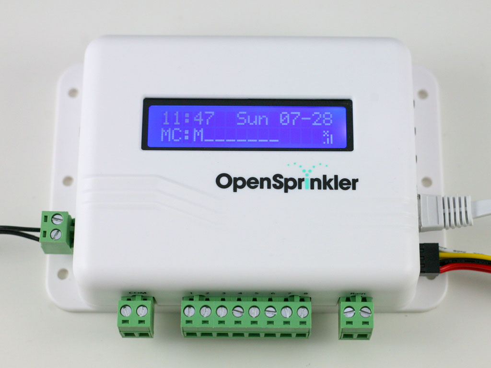

OpenSprinklerNet
================

.NET Library for querying and controlling your '[OpenSprinkler](http://www.opensprinkler.com/)' sprinkler controller.

Supports .NET 4.5, Windows 8.1 and Windows Phone 8.1.

 


###Sample code:

```csharp
//Open connection
var conn = await OpenSprinklerConnection.OpenAsync("http://192.168.1.99:80", "mypassword");
//Get controller metadata
ControllerInfo controllerInfo = await conn.GetControllerInfoAsync();
//Get current settings
ControllerSettingsInfo settings = await conn.GetControllerSettingsAsync();
//Get all programs
ProgramDetailsInfo programs = await conn.GetProgamDetailsAsync();
//Get info about the stations
StationInfo stationInfo = await conn.GetStationsAsync();
//Check whether sprinkler '1' is on
bool isOn = await conn.QueryStationStatusAsync(1);
//Check on/off status of all sprinklers
var stations = await conn.QueryStationStatusesAsync();
//Check if in manual mode
if (settings.ManualMode == Status.On)
{
	//Turn sprinkler 3 on
	await conn.SetStationStatusAsync(3, Status.On);	
	await Task.Delay(2000);
	//Turn sprinkler 3 off
	await conn.SetStationStatusAsync(3, Status.Off);
}
```
